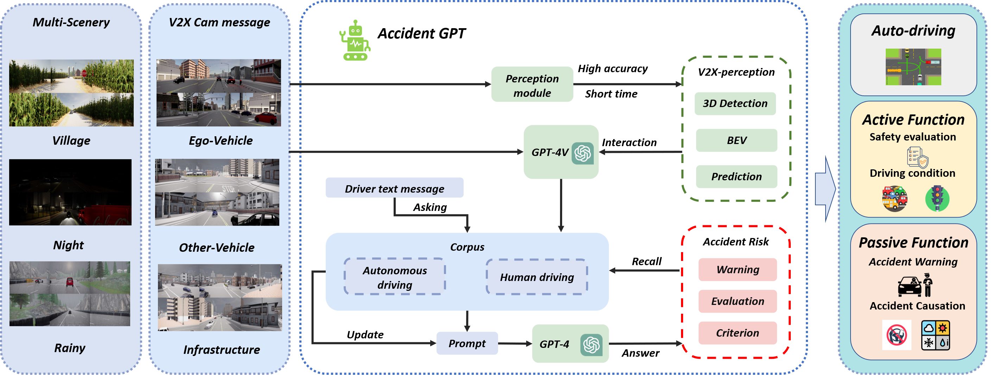
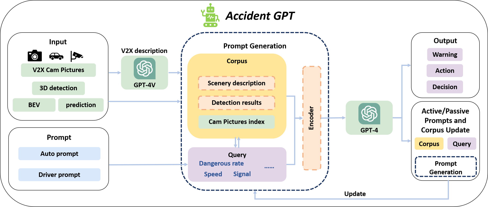

# AccidentGPT: Accident analysis and prevention from V2X Environmental Perception with Multi-modal Large Model

[](https://export.arxiv.org/abs/2312.13156)
[](https://accidentgpt.github.io)


## 🌟Highlights
- **`2023-12-15`** Our project page is now online, [Check it out here](https://accidentgpt.github.io)🔗!
- **`2023-12-21`** Our paper is available on [Arxiv](https://export.arxiv.org/abs/2312.13156)📄!

## 🚀Framework Overview



<div>
Our contributions can be mainly divided into the following parts:
<ol>
<li><b>Autonomous Vehicle Environmental Perception</b> We have developed a comprehensive scene perception and prediction system for fully autonomous vehicles. This system uses cameras on multiple vehicles and road-testing devices to create a unified BEV space, enabling 3D object detection, perspective analysis, and motion prediction. Our approach integrates multi-vehicle collaborative perception for enhanced environmental understanding and collision avoidance.
</li>
<li><b>Safety Enhancements for Human-driven Vehicles</b> For human-driven vehicles, we offer advanced safety features such as proactive remote safety warnings and blind spot alerts. Our system comprises distinct agents, labeling, and semantic modules that process visual data, including scene, BEV images, and 3D objects detection results. This multi-level modular input structure, supported by a corporate database and priority sampling module, improves the versatility of safety measures for human-driven vehicles.
</li>
<li><b>Traffic Safety Analysis for Enforcement Agencies</b> Our framework serves traffic police and management agencies by providing real-time intelligent analysis of traffic safety factors – pedestrian, vehicles, roads, and the environment. Utilizing collaborative perception from multiple vehicles and road testing devices, it delivers comprehensive reports on accident causes and responsibilities. The system's effectiveness is enhanced by a rich pre-training on an efficient traffic safety corpus, ensuring accurate analysis and insights.


</div>

## 🔍Core Module



The GPT-reasoning framework serves as the core element of AccidentGPT's functionality. Through intricate fusion and extraction of perceptual information along with various collected data, we introduce multiple modules within the semantic mega-model of GPT-4V. These modules efficiently provide advanced proactive cues for human-machine collaboration and passive information retrieval. The goal is to enhance the semantic interaction framework for human-machine collaboration, addressing both proactive and reactive tasks in traffic safety warnings and alerts. This, in turn, aims to elevate the bidirectional safety mission between humans and computers.


## Cite
```
@misc{wang2023accidentgpt,
    title={AccidentGPT: Accident analysis and prevention from V2X Environmental Perception with Multi-modal Large Model},
    author={Lening Wang and Han Jiang and Pinlong Cai and Daocheng Fu and Tianqi Wang and Zhiyong Cui and Yilong Ren and Haiyang Yu and Xuesong Wang and Yinhai Wang},
    year={2023},
    eprint={2312.13156},
    archivePrefix={arXiv},
    primaryClass={cs.CE}
}
```
